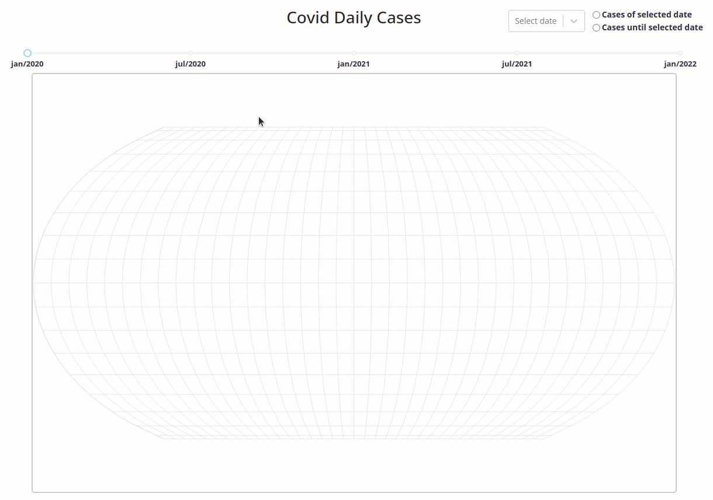

<h1 align="center">
  
</h1>

<h3 align="center">Geo Covid Cases</h3>

A Challenge by Coodesh

## 💻 About the project

 Geo Covid Cases provides information about covid cases around the world throughout the days.
 
 ## Demo

 #### Technologies Used 

  -  [ReactJS](https://reactjs.org/)
  -  [React Router](https://github.com/ReactTraining/react-router)
  -  [Supabase](https://supabase.com/)
  -  [Emotion Styled](https://emotion.sh/docs/styled/)

## 🔧 Run Project Locally

Assuming you already have npm or yarn or any package manager

### Clone this repository

#### `git clone https://github.com/gabrielrsp/geo-covid-cases.git`

### Install the dependencies

#### `run your package manager command for installing dependencies (ex: yarn or npm install)`

#### Execute the application 

#### `(ex: yarn dev or npm dev)`

#### The application will run on port 3000

Open [http://localhost:3000](http://localhost:3000) to see on the browser
